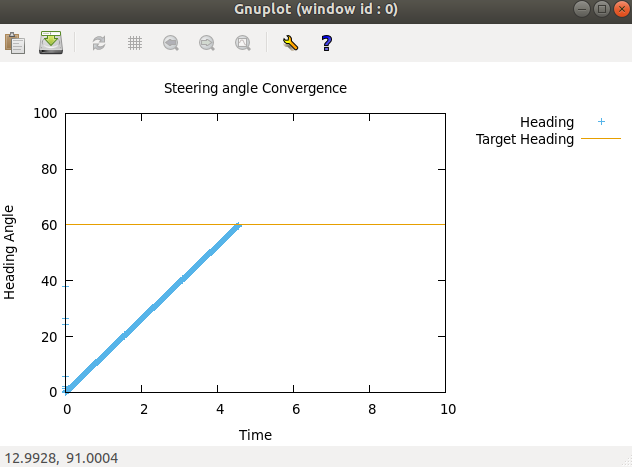
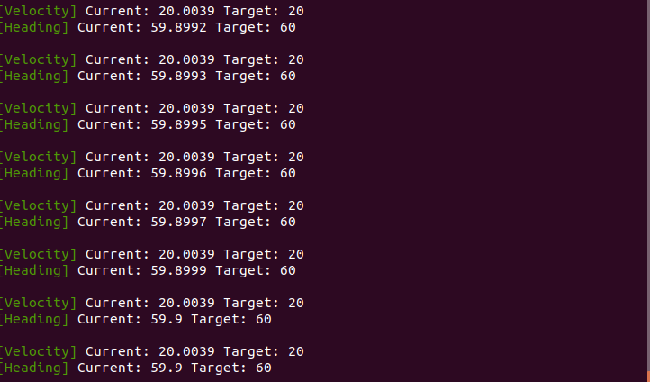

# Robot Controller
[](https://app.travis-ci.com/viveksood97/Robot_Contoller) 
[](https://coveralls.io/github/viveksood97/Robot_Contoller?branch=main)
[](https://opensource.org/licenses/MIT)


## Authors
[Vivek Sood](<https://github.com/viveksood97>) (UID 117504279)


# Overview
In this project we implement a controller for an Ackermann kinematic model with a maximum steering angle constraint (e.g. < 45 degrees) (input robot target heading and velocity, output steering and the two drive wheel velocities, demonstrating convergence to the set points).

## Agile Iterative Process
We have been following the agile methodology in this project to track all the tasks involved. We have been utilizing the notion platform to achieve this which can be seen in the link below:

[Notion Agile Board](https://www.notion.so/ba2e3747132a4b9585c73f50611917ac?v=434d3c71adf3443cb7631cdf5d560166)

## All the necessary links 
- Link for proposal: [Proposal](https://drive.google.com/file/d/1wLCBFTQJ4ZTIBm7_OMXAdsh-fdLl33LF/view)
- Link for proposal video: [Proposal Video](https://drive.google.com/drive/folders/1sYS6UQOdyQys9J8Een5iecVueSnCdDFZ)
- Link for proposal presentation: [Proposal Presentation](https://docs.google.com/presentation/d/1iLKKHUWsUh4rI2HVl6a0bfbaCnp-vlT2/edit#slide=id.gf6065eecf8_0_326)
- Link for quad chart: [Quad Chart](https://drive.google.com/file/d/16Bhl7vpuL6NwU_m8zxUkITL6Cl9oWY0c/view)
- Product Backlog: [AIP](https://docs.google.com/spreadsheets/d/1ycvQy3vhNMT0W67lCo_2hgW9C9ZCRkmT/edit?rtpof=true)
- Sprint notes: [Sprint Notes](https://docs.google.com/document/d/1DLwu79wBspcvC7MmG0XjFKFsAxMGOrq1Snp_ugRyVxg/edit)

## Standard install via command-line
```
git clone --recursive https://github.com/viveksood97/Robot_Contoller
cd <path to repository>
mkdir build
cd build
cmake ..
make
Run tests: ./test/cpp-test
Run program: ./app/shell-app
```


## Building for code coverage
Install code-coverage tool, else the code coverage command will not work. It is a one time installation: 
```
sudo apt-get install lcov
```
```
cmake -D COVERAGE=ON -D CMAKE_BUILD_TYPE=Debug ../
make
make code_coverage
```

This generates a index.html page in the build/coverage sub-directory that can be viewed locally in a web browser.

## Run cppcheck and cpplint
Run cppcheck: Results are stored in `./results/cppcheck.txt` 
```
cppcheck --enable=all --std=c++11 -I include/ --suppress=missingIncludeSystem $( find . -name *.cpp | grep -vE -e "^./build/" -e "^./vendor/" -e "^./lib") > results/cppcheck.txt 2>&1
```

Run cpplint: Results are stored in `./results/cpplint.txt`
```
cpplint $( find . -name \*.hpp -or -name \*.cpp | grep -vE -e "^./build/" -e "^./vendor/" -e "^./docs/" -e "^./results" -e "^./lib/") > results/cpplint.txt 2>&1
```

## Run Doxygen
Run Doxygen: Results are stored in `./docs/html/index.htlm`
```
doxygen docs/doxygen-file
```

## Dependencies
We have the following library dependencies:
- time.h 
- gnuPlot - http://stahlke.org/dan/gnuplot-iostream/

Install gnuplot
```
sudo apt-get install gnuplot
```
Install boost
```
sudo apt-get install libboost-all-dev
```
## Demo
Run the program. Once the velocities and headings are converged to the target then graphs will be displayed as below. Also, converged values will be shown in the terminal.

### Heading Convergence


### Velocity Convergence


### Terminal Output 


## References
- gnuplot- http://stahlke.org/dan/gnuplot-iostream/